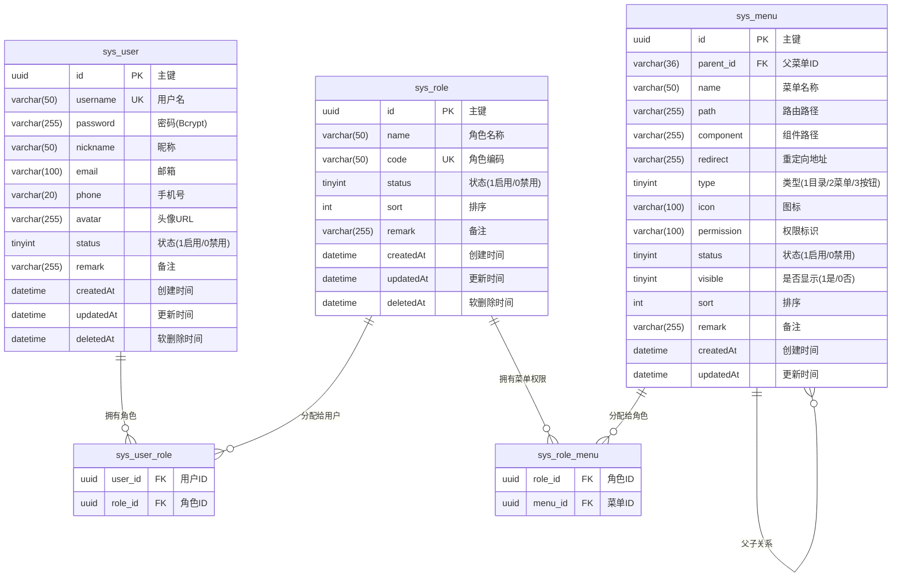
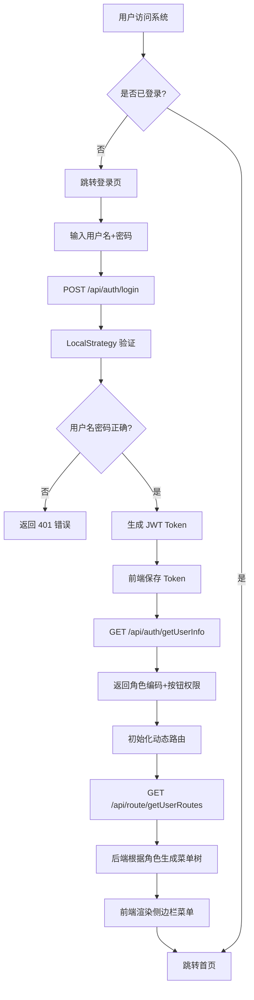
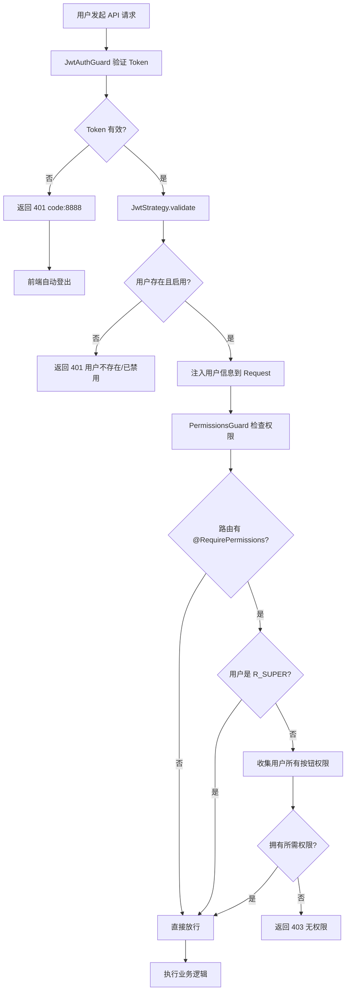
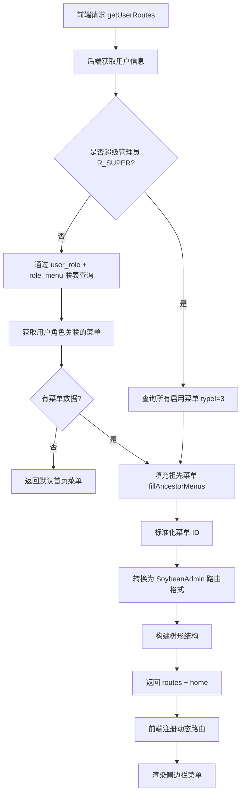
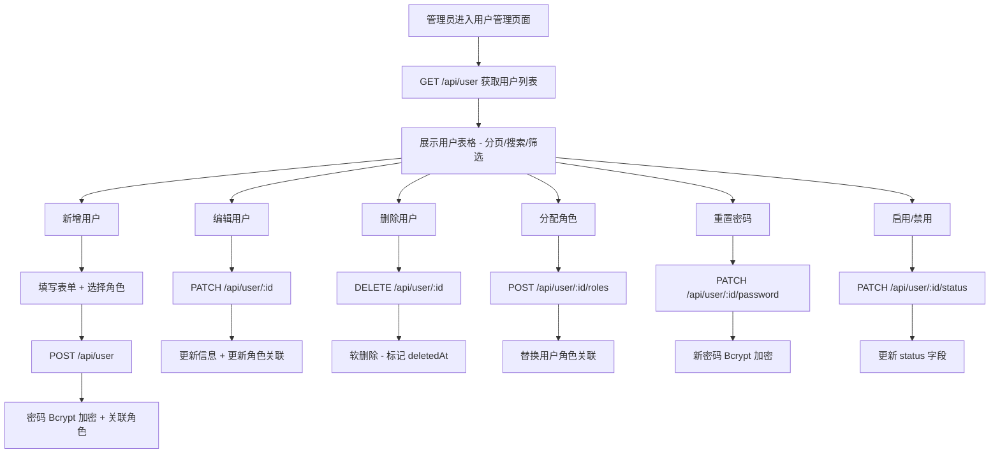
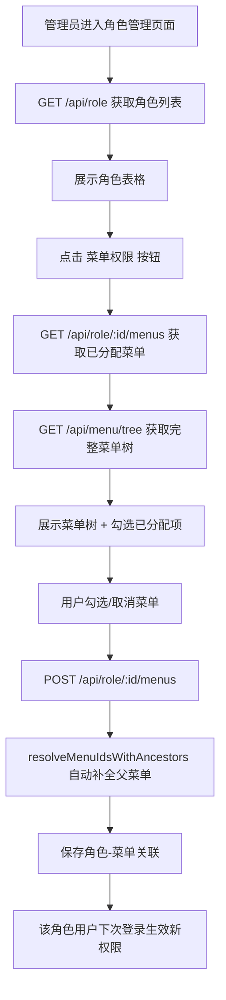

# Soybean Admin NestJS - 项目全貌文档

> 生成时间: 2026-02-20
> 基于代码版本: 56a4ca77d11944ee28bdae8409f39e6efe24d2d8

---

## 1. 项目概述

### 1.1 基本信息

| 字段 | 值 |
|------|-----|
| 项目名称 | Soybean Admin NestJS |
| 项目描述 | 基于 SoybeanAdmin 前端模板与 NestJS 后端框架构建的全栈后台管理系统 |
| 版本 | v0.9.0 |
| 语言/运行时 | TypeScript / Node.js >= 20 |
| 主框架 | 前端: Vue3 + Vite7 + NaiveUI；后端: NestJS 11 + TypeORM |
| 包管理器 | pnpm >= 10.5.0（强制） |

### 1.2 技术栈

| 类别 | 技术 | 用途 |
|------|------|------|
| 前端框架 | Vue 3.5 + Vite 7 | SPA 应用框架与构建工具 |
| UI 组件库 | NaiveUI 2.43 | 后台管理 UI 组件 |
| 状态管理 | Pinia 3.0 | 全局状态管理 |
| 路由 | Vue Router 4.6 + Elegant Router | 自动化文件路由系统 |
| CSS 方案 | UnoCSS | 原子化 CSS |
| 国际化 | vue-i18n 11 | 多语言支持 |
| 图表 | ECharts 6 | 数据可视化 |
| 后端框架 | NestJS 11 | RESTful API 服务 |
| 数据库 | MySQL 8.0+ | 关系型数据库 |
| ORM | TypeORM 0.3 | 数据库对象关系映射 |
| 认证 | Passport + JWT | 用户认证与授权 |
| API 文档 | Swagger (NestJS) | 自动生成 API 文档 |
| 数据验证 | class-validator + class-transformer | DTO 验证与转换 |
| 密码加密 | bcryptjs | 密码哈希加密 |

### 1.3 关键依赖

#### 后端

| 依赖名 | 版本 | 用途 |
|---------|------|------|
| @nestjs/core | ^11.0.1 | NestJS 核心框架 |
| @nestjs/typeorm | ^11.0.0 | TypeORM 集成 |
| @nestjs/jwt | ^11.0.2 | JWT Token 生成与验证 |
| @nestjs/passport | ^11.0.5 | Passport 认证策略集成 |
| @nestjs/swagger | ^11.2.3 | Swagger API 文档 |
| mysql2 | ^3.16.0 | MySQL 驱动 |
| bcryptjs | ^3.0.3 | 密码加密 |
| class-validator | ^0.14.3 | DTO 验证 |

#### 前端

| 依赖名 | 版本 | 用途 |
|---------|------|------|
| vue | 3.5.26 | 前端框架 |
| naive-ui | 2.43.2 | UI 组件库 |
| pinia | 3.0.4 | 状态管理 |
| vue-router | 4.6.4 | 路由管理 |
| @elegant-router/vue | 0.3.8 | 自动化文件路由 |
| echarts | 6.0.0 | 图表库 |
| vue-i18n | 11.2.7 | 国际化 |
| dayjs | 1.11.19 | 日期处理 |
| @sa/axios | workspace:* | 封装的 HTTP 请求库 |

### 1.4 环境配置

#### 后端 (.env)

| 配置项 | 说明 | 默认值 |
|--------|------|--------|
| PORT | 服务端口 | 3000 |
| NODE_ENV | 运行环境 | development |
| DB_HOST | 数据库主机 | localhost |
| DB_PORT | 数据库端口 | 3306 |
| DB_USER | 数据库用户 | root |
| DB_PASSWORD | 数据库密码 | - |
| DB_NAME | 数据库名 | soybean_admin |
| DB_SYNC | 自动同步表结构 | true (开发环境) |
| JWT_SECRET | JWT 密钥 | soybean_admin_secret |
| JWT_EXPIRES_IN | Access Token 过期时间 | 7d |
| JWT_REFRESH_SECRET | Refresh Token 密钥 | soybean_admin_refresh_secret |
| JWT_REFRESH_EXPIRES_IN | Refresh Token 过期时间 | 30d |

#### 前端 (.env.development)

| 配置项 | 说明 | 默认值 |
|--------|------|--------|
| VITE_SERVICE_BASE_URL | 后端 API 地址 | http://localhost:3000/api |
| VITE_AUTH_ROUTE_MODE | 路由模式 | dynamic |
| VITE_SERVICE_SUCCESS_CODE | 成功响应码 | 0000 |

---

## 2. 目录结构与模块划分

### 2.1 顶层目录结构

```
soybean-admin-nestjs/
├── server/                       # 后端项目 (NestJS, 端口 3000, API 前缀 /api)
├── soybean-admin/                # 前端项目 (Vite, 端口 9527)
├── 项目优化指南.md
└── README.md
```

### 2.2 后端目录结构

```
server/src/
├── main.ts                       # 入口文件（CORS、Swagger、全局管道/拦截器/过滤器）
├── app.module.ts                 # 全局模块注册
├── app.controller.ts             # 根控制器
├── app.service.ts                # 根服务
├── entities/                     # TypeORM 实体（数据库表定义）
│   ├── user.entity.ts           # 用户实体 (sys_user)
│   ├── role.entity.ts           # 角色实体 (sys_role)
│   └── menu.entity.ts           # 菜单实体 (sys_menu)
├── modules/                      # 业务功能模块
│   ├── auth/                    # 认证模块
│   │   ├── auth.controller.ts   # 认证路由
│   │   ├── auth.service.ts      # 认证逻辑
│   │   ├── auth.module.ts       # 模块配置
│   │   ├── jwt.strategy.ts      # JWT 策略
│   │   ├── local.strategy.ts    # 本地认证策略
│   │   ├── guards/              # 认证守卫
│   │   └── dto/                 # 数据传输对象
│   ├── user/                    # 用户管理模块
│   │   ├── user.controller.ts
│   │   ├── user.service.ts
│   │   └── dto/
│   ├── role/                    # 角色管理模块
│   │   ├── role.controller.ts
│   │   ├── role.service.ts
│   │   └── dto/
│   ├── menu/                    # 菜单管理模块
│   │   ├── menu.controller.ts
│   │   ├── menu.service.ts
│   │   └── dto/
│   └── route/                   # 动态路由模块
│       ├── route.controller.ts
│       └── route.service.ts
├── common/                       # 公共模块
│   ├── decorators/              # 自定义装饰器
│   │   ├── current-user.decorator.ts    # @CurrentUser() 注入当前用户
│   │   └── permissions.decorator.ts     # @RequirePermissions() 权限标记
│   ├── guards/                  # 守卫
│   │   └── permissions.guard.ts # 权限守卫（RBAC 权限检查）
│   ├── interceptors/            # 拦截器
│   │   └── transform.interceptor.ts     # 统一响应格式 { code, data, msg }
│   └── filters/                 # 异常过滤器
│       └── http-exception.filter.ts     # 统一异常处理
├── config/                       # 配置文件
└── database/                     # 数据库相关
    └── seeds/seed.ts            # 种子数据脚本
```

### 2.3 前端目录结构

```
soybean-admin/src/
├── main.ts                       # 入口文件
├── App.vue                       # 根组件
├── router/                       # 路由配置
│   ├── elegant/                 # Elegant Router 自动生成
│   ├── routes/                  # 路由定义
│   ├── guard/                   # 路由守卫（权限、进度条、标题）
│   └── index.ts                 # 路由初始化
├── service/                      # API 服务层
│   ├── api/                     # API 函数
│   │   ├── auth.ts              # 认证 API
│   │   ├── user.ts              # 用户管理 API
│   │   ├── role.ts              # 角色管理 API
│   │   ├── menu.ts              # 菜单管理 API
│   │   ├── route.ts             # 路由 API
│   │   └── dog.ts               # 狗狗管理 API（示例业务）
│   └── request/                 # HTTP 请求封装
├── store/                        # Pinia 状态管理
│   └── modules/
│       ├── auth/                # 认证 Store（登录、用户信息、Token）
│       ├── route/               # 路由 Store（菜单、面包屑、缓存路由）
│       ├── app/                 # 应用 Store（语言、移动端、侧边栏）
│       ├── tab/                 # 标签页 Store
│       ├── theme/               # 主题 Store（颜色、深色模式、水印）
│       └── dog/                 # 狗狗 Store（示例业务）
├── views/                        # 页面组件
│   ├── _builtin/                # 内置页面（登录、403/404/500、iframe）
│   ├── home/                    # 首页仪表盘
│   └── system/                  # 系统管理
│       ├── user/                # 用户管理页面
│       ├── role/                # 角色管理页面
│       └── menu/                # 菜单管理页面
├── typings/                      # TypeScript 类型定义
├── components/                   # 可复用组件
├── layouts/                      # 布局组件
├── hooks/                        # 自定义 Hooks
├── locales/                      # 国际化资源
├── utils/                        # 工具函数
├── constants/                    # 常量定义
├── enum/                         # 枚举定义
├── directives/                   # 自定义指令
├── plugins/                      # Vue 插件
├── styles/                       # 全局样式
├── theme/                        # 主题配置
└── assets/                       # 静态资源
```

### 2.4 模块清单

| 模块名 | 路径 | 职责描述 |
|--------|------|----------|
| Auth | backend/src/modules/auth/ | 用户认证（登录、注册、JWT Token、用户信息） |
| User | backend/src/modules/user/ | 用户 CRUD、分页搜索、状态管理、角色分配、密码重置 |
| Role | backend/src/modules/role/ | 角色 CRUD、分页搜索、菜单权限分配 |
| Menu | backend/src/modules/menu/ | 菜单 CRUD、树形结构、用户权限菜单树、SoybeanAdmin 格式转换 |
| Route | backend/src/modules/route/ | 动态路由分发（获取用户路由、常量路由） |
| Common | backend/src/common/ | 公共基础设施（权限守卫、响应拦截器、异常过滤器、装饰器） |

---

## 3. 功能清单与页面列表

### 3.1 功能清单

| 功能模块 | 功能点 | 描述 | 对应文件/路径 |
|----------|--------|------|---------------|
| 认证 | 用户登录 | 用户名+密码登录，返回 JWT Token | auth.controller.ts / auth.service.ts |
| 认证 | 用户注册 | 新用户注册，密码 Bcrypt 加密 | auth.controller.ts / auth.service.ts |
| 认证 | 获取用户信息 | 返回用户角色编码列表 + 按钮权限列表 | auth.service.ts → getUserInfo() |
| 认证 | Token 刷新 | 独立 Refresh Token 刷新（无需 Access Token） | auth.controller.ts → refreshToken() |
| 认证 | 退出登录 | 退出登录（前端清除 Token） | auth.controller.ts → logout() |
| 用户管理 | 用户列表 | 分页查询 + 多字段模糊搜索 + 状态筛选 | user.service.ts → findAll() |
| 用户管理 | 创建用户 | 创建用户并关联角色 | user.service.ts → create() |
| 用户管理 | 编辑用户 | 更新用户信息和角色关联 | user.service.ts → update() |
| 用户管理 | 删除用户 | 软删除（单个/批量） | user.service.ts → remove/removeMany() |
| 用户管理 | 启用/禁用 | 切换用户状态 | user.service.ts → updateStatus() |
| 用户管理 | 重置密码 | 管理员重置用户密码 | user.service.ts → resetPassword() |
| 用户管理 | 分配角色 | 为用户分配角色 | user.service.ts → assignRoles() |
| 角色管理 | 角色列表 | 分页查询 + 搜索 | role.service.ts → findAll() |
| 角色管理 | 创建角色 | 创建角色（编码唯一性验证） | role.service.ts → create() |
| 角色管理 | 编辑角色 | 更新角色信息 | role.service.ts → update() |
| 角色管理 | 删除角色 | 软删除（单个/批量） | role.service.ts → remove/removeMany() |
| 角色管理 | 分配菜单权限 | 为角色分配菜单（自动包含父菜单） | role.service.ts → assignMenus() |
| 角色管理 | 查看菜单权限 | 获取角色已分配的菜单列表 | role.service.ts → findRoleMenus() |
| 菜单管理 | 菜单树 | 获取菜单树形结构 | menu.service.ts → getTree() |
| 菜单管理 | 菜单列表 | 获取扁平菜单列表 | menu.service.ts → findAll() |
| 菜单管理 | 创建菜单 | 创建目录/菜单/按钮 | menu.service.ts → create() |
| 菜单管理 | 编辑菜单 | 更新菜单信息 | menu.service.ts → update() |
| 菜单管理 | 删除菜单 | 删除菜单（检查子菜单依赖） | menu.service.ts → remove/removeMany() |
| 菜单管理 | 用户权限菜单 | 根据用户角色生成前端路由树 | menu.service.ts → getUserMenuTree() |
| 动态路由 | 获取用户路由 | 返回用户权限路由 + 默认首页 | route.service.ts → getUserRoutes() |
| 动态路由 | 获取常量路由 | 返回公开路由（当前为空） | route.service.ts → getConstantRoutes() |
| 权限控制 | RBAC 权限 | 基于 用户→角色→菜单(按钮) 的三层权限模型 | permissions.guard.ts |
| 权限控制 | 超级管理员 | R_SUPER 角色跳过所有权限检查 | permissions.guard.ts |

### 3.2 页面/路由列表

| 路由路径 | 页面名称 | 描述 | 对应组件/文件 |
|----------|----------|------|---------------|
| /login | 登录页 | 用户登录（支持密码登录、验证码登录、注册） | views/_builtin/login/ |
| /home | 首页仪表盘 | 系统首页 | views/home/index.vue |
| /system | 系统管理 | 目录（layout.base） | - |
| /system/user | 用户管理 | 用户列表、新增、编辑、删除、角色分配、重置密码 | views/system/user/index.vue |
| /system/role | 角色管理 | 角色列表、新增、编辑、删除、菜单权限分配 | views/system/role/index.vue |
| /system/menu | 菜单管理 | 菜单树形列表、新增、编辑、删除 | views/system/menu/index.vue |
| /403 | 无权限 | 403 错误页 | views/_builtin/403/ |
| /404 | 未找到 | 404 错误页 | views/_builtin/404/ |
| /500 | 服务器错误 | 500 错误页 | views/_builtin/500/ |
| /iframe-page/:url | iframe 页面 | 动态 iframe 容器 | views/_builtin/iframe-page/ |

---

## 4. API 接口文档

### 4.1 全局约定

- API 基础路径: `/api`
- 认证方式: Bearer Token (JWT)
- 成功响应格式: `{ code: "0000", data: T, msg: "success" }`
- 错误响应格式: `{ code: "状态码", data: null, msg: "错误信息" }`
- 未授权响应: `{ code: "8888", data: null, msg: "Unauthorized" }` → 前端自动登出
- Swagger 文档地址: `http://localhost:3000/api-docs`

### 4.2 接口总览

| 模块 | 方法 | 路径 | 描述 | 认证 |
|------|------|------|------|------|
| 认证 | POST | /api/auth/login | 用户登录 | 无 |
| 认证 | POST | /api/auth/register | 用户注册 | 无 |
| 认证 | GET | /api/auth/getUserInfo | 获取用户信息（角色+权限） | JWT |
| 认证 | GET | /api/auth/profile | 获取用户详情 | JWT |
| 认证 | POST | /api/auth/logout | 退出登录 | JWT |
| 认证 | POST | /api/auth/refreshToken | 刷新 Token | 无（使用 Refresh Token） |
| 用户 | POST | /api/user | 创建用户 | JWT + sys:user:add |
| 用户 | GET | /api/user | 获取用户列表（分页） | JWT |
| 用户 | GET | /api/user/:id | 获取用户详情 | JWT |
| 用户 | PATCH | /api/user/:id | 更新用户信息 | JWT + sys:user:edit |
| 用户 | DELETE | /api/user/:id | 删除用户 | JWT + sys:user:delete |
| 用户 | DELETE | /api/user/batch | 批量删除用户 | JWT + sys:user:delete |
| 用户 | PATCH | /api/user/:id/status | 启用/禁用用户 | JWT + sys:user:edit |
| 用户 | PATCH | /api/user/:id/password | 重置密码 | JWT + sys:user:edit |
| 用户 | POST | /api/user/:id/roles | 分配角色 | JWT + sys:user:edit |
| 角色 | POST | /api/role | 创建角色 | JWT + sys:role:add |
| 角色 | GET | /api/role | 获取角色列表（分页） | JWT |
| 角色 | GET | /api/role/:id | 获取角色详情 | JWT |
| 角色 | PATCH | /api/role/:id | 更新角色 | JWT + sys:role:edit |
| 角色 | DELETE | /api/role/:id | 删除角色 | JWT + sys:role:delete |
| 角色 | DELETE | /api/role/batch | 批量删除角色 | JWT + sys:role:delete |
| 角色 | POST | /api/role/:id/menus | 分配菜单权限 | JWT + sys:role:edit |
| 角色 | GET | /api/role/:id/menus | 获取角色菜单权限 | JWT |
| 菜单 | POST | /api/menu | 创建菜单 | JWT + sys:menu:add |
| 菜单 | GET | /api/menu | 获取菜单树形结构 | JWT |
| 菜单 | GET | /api/menu/tree | 获取菜单树（别名） | JWT |
| 菜单 | GET | /api/menu/list | 获取菜单列表（扁平） | JWT |
| 菜单 | GET | /api/menu/user/:userId | 获取用户菜单权限树 | JWT |
| 菜单 | GET | /api/menu/:id | 获取菜单详情 | JWT |
| 菜单 | PATCH | /api/menu/:id | 更新菜单 | JWT + sys:menu:edit |
| 菜单 | DELETE | /api/menu/:id | 删除菜单 | JWT + sys:menu:delete |
| 菜单 | DELETE | /api/menu/batch | 批量删除菜单 | JWT + sys:menu:delete |
| 路由 | GET | /api/route/getUserRoutes | 获取用户路由 | JWT |
| 路由 | GET | /api/route/getConstantRoutes | 获取常量路由 | JWT |
| 路由 | GET | /api/route/isRouteExist | 检查路由是否存在 | JWT |

### 4.3 接口详情

#### 认证模块

**用户登录**
- 方法: `POST`
- 路径: `/api/auth/login`
- 请求体:

| 参数名 | 类型 | 必填 | 描述 |
|--------|------|------|------|
| username | string | 是 | 用户名 |
| password | string | 是 | 密码（最少6位） |

- 响应示例:

```json
{
  "code": "0000",
  "data": {
    "token": "eyJhbGciOiJIUzI1NiIs...",
    "refreshToken": "eyJhbGciOiJIUzI1NiIs..."
  },
  "msg": "success"
}
```

**获取用户信息**
- 方法: `GET`
- 路径: `/api/auth/getUserInfo`
- 认证: Bearer Token
- 响应示例:

```json
{
  "code": "0000",
  "data": {
    "userId": "561917f3-2b27-466e-9878-100220917637",
    "userName": "admin",
    "roles": ["R_SUPER"],
    "buttons": ["sys:user:add", "sys:user:edit", "sys:user:delete", "sys:user:reset"]
  },
  "msg": "success"
}
```

#### 用户管理模块

**获取用户列表**
- 方法: `GET`
- 路径: `/api/user`
- 认证: Bearer Token
- 查询参数:

| 参数名 | 类型 | 必填 | 描述 |
|--------|------|------|------|
| page | number | 否 | 页码（默认 1） |
| pageSize | number | 否 | 每页数量（默认 10） |
| username | string | 否 | 用户名模糊搜索 |
| nickname | string | 否 | 昵称模糊搜索 |
| email | string | 否 | 邮箱模糊搜索 |
| phone | string | 否 | 手机号模糊搜索 |
| status | number | 否 | 状态筛选（0/1） |

- 响应示例:

```json
{
  "code": "0000",
  "data": {
    "records": [{ "id": "...", "username": "admin", "nickname": "超级管理员", "roles": [...] }],
    "total": 1,
    "current": 1,
    "size": 10
  },
  "msg": "success"
}
```

**创建用户**
- 方法: `POST`
- 路径: `/api/user`
- 认证: Bearer Token + sys:user:add
- 请求体:

| 参数名 | 类型 | 必填 | 描述 |
|--------|------|------|------|
| username | string | 是 | 用户名 |
| password | string | 是 | 密码（最少6位） |
| nickname | string | 是 | 昵称 |
| email | string | 否 | 邮箱 |
| phone | string | 否 | 手机号 |
| avatar | string | 否 | 头像 URL |
| status | number | 否 | 状态（0/1，默认 1） |
| remark | string | 否 | 备注 |
| roleIds | string[] | 否 | 角色 ID 列表 |

**重置密码**
- 方法: `PATCH`
- 路径: `/api/user/:id/password`
- 认证: Bearer Token + sys:user:edit
- 请求体:

| 参数名 | 类型 | 必填 | 描述 |
|--------|------|------|------|
| password | string | 是 | 新密码（最少6位） |

**分配角色**
- 方法: `POST`
- 路径: `/api/user/:id/roles`
- 认证: Bearer Token + sys:user:edit
- 请求体:

| 参数名 | 类型 | 必填 | 描述 |
|--------|------|------|------|
| roleIds | string[] | 是 | 角色 ID 列表 |

#### 角色管理模块

**获取角色列表**
- 方法: `GET`
- 路径: `/api/role`
- 查询参数:

| 参数名 | 类型 | 必填 | 描述 |
|--------|------|------|------|
| page | number | 否 | 页码（默认 1） |
| pageSize | number | 否 | 每页数量（默认 10） |
| name | string | 否 | 角色名称模糊搜索 |
| code | string | 否 | 角色编码模糊搜索 |
| status | number | 否 | 状态筛选（0/1） |

**创建角色**
- 方法: `POST`
- 路径: `/api/role`
- 请求体:

| 参数名 | 类型 | 必填 | 描述 |
|--------|------|------|------|
| name | string | 是 | 角色名称 |
| code | string | 是 | 角色编码（唯一） |
| sort | number | 否 | 排序（默认 0） |
| status | number | 否 | 状态（0/1，默认 1） |
| remark | string | 否 | 备注 |

**分配菜单权限**
- 方法: `POST`
- 路径: `/api/role/:id/menus`
- 请求体:

| 参数名 | 类型 | 必填 | 描述 |
|--------|------|------|------|
| menuIds | string[] | 是 | 菜单 ID 列表（自动包含父菜单） |

#### 菜单管理模块

**创建菜单**
- 方法: `POST`
- 路径: `/api/menu`
- 请求体:

| 参数名 | 类型 | 必填 | 描述 |
|--------|------|------|------|
| parentId | string | 否 | 父菜单 ID |
| name | string | 是 | 菜单名称 |
| path | string | 否 | 路由路径 |
| component | string | 否 | 组件路径 |
| redirect | string | 否 | 重定向路径 |
| type | number | 是 | 类型（1:目录, 2:菜单, 3:按钮） |
| icon | string | 否 | 图标 |
| permission | string | 否 | 权限标识（按钮类型使用） |
| status | number | 否 | 状态（0/1，默认 1） |
| visible | number | 否 | 是否显示（0/1，默认 1） |
| sort | number | 否 | 排序（默认 0） |
| remark | string | 否 | 备注 |

---

## 5. 数据模型/数据库设计

### 5.1 实体关系图



### 5.2 实体详情

#### sys_user（用户表）

| 字段名 | 类型 | 约束 | 描述 |
|--------|------|------|------|
| id | UUID | PK | 主键 |
| username | VARCHAR(50) | UNIQUE, NOT NULL | 用户名 |
| password | VARCHAR(255) | NOT NULL, select:false | 密码（Bcrypt 加密，查询默认不返回） |
| nickname | VARCHAR(50) | NULL | 昵称 |
| email | VARCHAR(100) | NULL | 邮箱 |
| phone | VARCHAR(20) | NULL | 手机号 |
| avatar | VARCHAR(255) | NULL | 头像 URL |
| status | TINYINT | DEFAULT 1 | 状态（1:启用, 0:禁用） |
| remark | VARCHAR(255) | NULL | 备注 |
| createdAt | DATETIME(6) | NOT NULL | 创建时间 |
| updatedAt | DATETIME(6) | NOT NULL | 更新时间 |
| deletedAt | DATETIME(6) | NULL | 软删除时间 |

#### sys_role（角色表）

| 字段名 | 类型 | 约束 | 描述 |
|--------|------|------|------|
| id | UUID | PK | 主键 |
| name | VARCHAR(50) | NOT NULL | 角色名称 |
| code | VARCHAR(50) | UNIQUE, NOT NULL | 角色编码（如 R_SUPER, R_USER） |
| status | TINYINT | DEFAULT 1 | 状态（1:启用, 0:禁用） |
| sort | INT | DEFAULT 0 | 排序 |
| remark | VARCHAR(255) | NULL | 备注 |
| createdAt | DATETIME(6) | NOT NULL | 创建时间 |
| updatedAt | DATETIME(6) | NOT NULL | 更新时间 |
| deletedAt | DATETIME(6) | NULL | 软删除时间 |

#### sys_menu（菜单表）

| 字段名 | 类型 | 约束 | 描述 |
|--------|------|------|------|
| id | UUID | PK | 主键 |
| parent_id | VARCHAR(36) | NULL, FK | 父菜单 ID（树形结构，materialized-path） |
| name | VARCHAR(50) | NOT NULL | 菜单名称 |
| path | VARCHAR(255) | NULL | 路由路径 |
| component | VARCHAR(255) | NULL | 组件路径 |
| redirect | VARCHAR(255) | NULL | 重定向地址 |
| type | TINYINT | DEFAULT 1 | 类型（1:目录, 2:菜单, 3:按钮） |
| icon | VARCHAR(100) | NULL | 图标（支持 `local:` 前缀本地图标） |
| permission | VARCHAR(100) | NULL | 权限标识（如 sys:user:add） |
| status | TINYINT | DEFAULT 1 | 状态（1:启用, 0:禁用） |
| visible | TINYINT | DEFAULT 1 | 是否显示（1:是, 0:否） |
| sort | INT | DEFAULT 0 | 排序 |
| remark | VARCHAR(255) | NULL | 备注 |
| createdAt | DATETIME(6) | NOT NULL | 创建时间 |
| updatedAt | DATETIME(6) | NOT NULL | 更新时间 |

#### sys_user_role（用户-角色关联表）

| 字段名 | 类型 | 约束 | 描述 |
|--------|------|------|------|
| user_id | UUID | FK → sys_user.id | 用户 ID |
| role_id | UUID | FK → sys_role.id | 角色 ID |

#### sys_role_menu（角色-菜单关联表）

| 字段名 | 类型 | 约束 | 描述 |
|--------|------|------|------|
| role_id | UUID | FK → sys_role.id | 角色 ID |
| menu_id | UUID | FK → sys_menu.id | 菜单 ID |

### 5.3 初始化种子数据

#### 角色

| 编码 | 名称 | 说明 |
|------|------|------|
| R_SUPER | 超级管理员 | 拥有系统所有权限，跳过权限检查 |
| R_USER | 普通用户 | 拥有基础查看权限 |

#### 菜单树

```
├── 仪表盘 (type:2, path:/home, component:layout.base$view.home)
│
└── 系统管理 (type:1, path:/system, component:layout.base)
    ├── 用户管理 (type:2, path:/system/user, component:view.system_user)
    │   ├── 用户新增 (type:3, permission:sys:user:add)
    │   ├── 用户编辑 (type:3, permission:sys:user:edit)
    │   ├── 用户删除 (type:3, permission:sys:user:delete)
    │   └── 用户重置密码 (type:3, permission:sys:user:reset)
    │
    ├── 角色管理 (type:2, path:/system/role, component:view.system_role)
    │   ├── 角色新增 (type:3, permission:sys:role:add)
    │   ├── 角色编辑 (type:3, permission:sys:role:edit)
    │   ├── 角色删除 (type:3, permission:sys:role:delete)
    │   └── 角色权限分配 (type:3, permission:sys:role:assign)
    │
    └── 菜单管理 (type:2, path:/system/menu, component:view.system_menu)
        ├── 菜单新增 (type:3, permission:sys:menu:add)
        ├── 菜单编辑 (type:3, permission:sys:menu:edit)
        └── 菜单删除 (type:3, permission:sys:menu:delete)
```

#### 默认管理员

| 用户名 | 密码 | 角色 |
|--------|------|------|
| admin | 123456 | R_SUPER（超级管理员） |

---

## 6. 业务流程

### 6.1 用户认证流程



### 6.2 RBAC 权限控制流程



### 6.3 动态路由生成流程



### 6.4 用户管理业务流程



### 6.5 角色权限分配流程



### 6.6 流程说明

| 流程名称 | 触发条件 | 涉及模块 | 描述 |
|----------|----------|----------|------|
| 用户登录 | 用户访问系统 | Auth, Route, Store | 验证凭证 → 生成 Token → 获取用户信息 → 初始化路由 |
| 权限检查 | 每次 API 请求 | Auth Guards, Permissions Guard | JWT 验证 → 超管跳过 → 按钮权限匹配 |
| 动态路由 | 登录成功后 | Route, Menu, Auth Store | 根据角色查询菜单 → 转换格式 → 注册路由 |
| 用户 CRUD | 管理员操作 | User, Role | 创建/编辑/删除用户，关联角色 |
| 角色权限 | 管理员操作 | Role, Menu | 为角色分配菜单权限，自动补全父菜单 |
| 菜单管理 | 管理员操作 | Menu | 维护菜单树（目录/菜单/按钮），影响路由和权限 |

---

## 7. 备注

- [推断] 前端 `dog` 模块（狗狗管理）为示例业务模块，后端暂未发现对应实现
- Refresh Token 使用独立密钥和 30d 过期时间，Access Token 过期后可通过 Refresh Token 无感刷新
- 密码字段在实体层设置 `select: false`，所有查询默认不返回密码
- 角色/菜单管理的写操作已启用 PermissionsGuard 权限控制
- 删除角色前会检查用户关联，有关联则阻止删除
- [推断] 常量路由当前返回空数组，所有路由均通过动态方式加载
- 菜单实体使用 TypeORM 的 `materialized-path` 树形策略
- 用户和角色支持软删除（deletedAt），菜单为物理删除
- 超级管理员角色编码 `R_SUPER` 为硬编码，在权限守卫和菜单查询中均有特殊处理
- 本文档由 AI 自动生成，建议人工审核后使用
